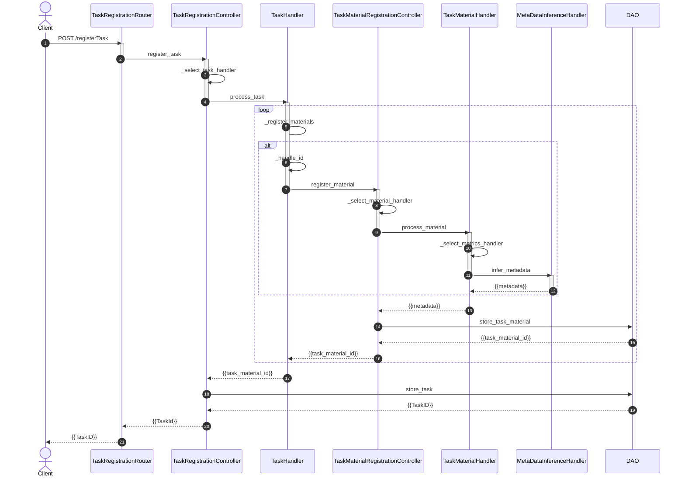

# Geteilter Aufgabenpool

An einen geteilten Aufgabenpool stellen sich mehrere Anforderungen:

- Austauschformat zur Abbildung von - insb. - Aufgaben zu SQL-Abfragen und ER-Modellierung
- Vollständige Information über eine Aufgabe, um diese in ein beliebiges System (z. B. LMS wie Moodle, Ilias oder OPAL; Assessment-Systeme wie Stack oder Onyx; eigens entwickelte Systeme, wie z. B. EasyTutor oder ALADIN) "zurück zu übersetzen"
- Auffindbarkeit von Aufgaben anhand sinnvoller Suchkriterien

Die [Item-Pool-API](https://github.com/neda-digital/ItemPoolAPI) versucht, diese Anforderungen vollständig zu erfüllen ohne hohen manuellen Aufwand für Import- und Export zu verursachen.

Nachfolgendes Sequenz-Diagramm zeigt die Prozessschritte der API während des Imports einer Aufgabe. Der erste Prozessschrit ist die Zerlegung einer Aufgabe in einzelne Bestandteile (Stimuli [^1] und Musterlösungen), das Erfassen von Metadaten - insbesondere Merkmale der jeweiligen Aufgabenbestandteile (z. B. Metriken zur Komplexität einer SQL-Abfrage oder Verständlichkeit eines Texts) - und das Abspeichern der Bestandteile mitsamt der erfassten Metadaten.

Mehr Informationen finden sich unter [^2].

Die API soll zukünftig um weitere Aufgabentypen und die Erfassung von (anonymisierten) Lösungsversuchen der jeweiligen Aufgaben durch Lernende erweitert werden.

---

[^1]: Garner, W.R. (1974). The Stimulus in Information Processing. In: Moskowitz, H.R., Scharf, B., Stevens, J.C. (eds) Sensation and Measurement. Springer, Dordrecht. https://doi.org/10.1007/978-94-010-2245-3_7
[^2]: https://github.com/neda-digital/ItemPoolAPI/wiki/API-Sequence-Diagram
