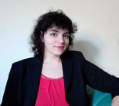
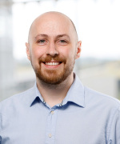

# Mitglieder

## Professor Dr.-Ing Jörg M. Haake

- **Interessen**: CSCW, CSCL, Kollaborative Lernsysteme, ITS
- [**Mehr Informationen**](https://www.fernuni-hagen.de/ks/team/joerg.haake.shtml)

## Dr.-Ing Regina Kasakowskij

- **Interessen**: Self-Assessment, Feedback, Feedback-Generierung
- [**Mehr Informationen**](https://www.fernuni-hagen.de/ks/team/regina.kasakowskij.shtml)

## M. Sc. Paul Christ

- **Interessen**: Automatic Item Generation, Adaptive Lernsysteme, Konzeptuelle Modellierung, SQL
- [**Mehr Informationen**](https://www.fernuni-hagen.de/ks/team/paul.christ.shtml)
